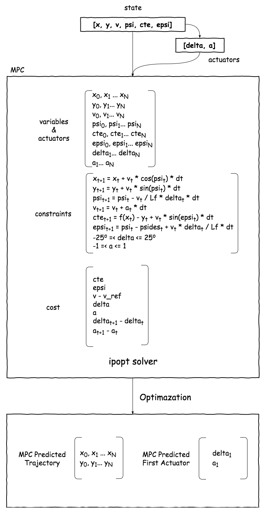

# CarND-Controls-MPC
Self-Driving Car Engineer Nanodegree Program
-- Elsa Wang
---

## Basic Build Instructions

1. Clone this repo.
2. Make a build directory: `mkdir build && cd build`
3. Compile: `cmake .. && make`
4. Run it: `./mpc`.

## The model

The model follows above process. First, the model get input state from simulator, including referecnce waypoints and current state. The **cross track error** and **reference trajectory** 3rd polynomial function **f(x)** could be calculated.

There are multiple variables (and actuators) needed MPC to find optimum solution with using ipopt solver. The model uses **kinematic model** to update the states (notice: psi function is changed caused simulator turning). These update functions are also used to constrain the solver.

The cost function uses `cte` and `epsi` to limit the difference between reference trajectory and predicted trajectory; uses `v-v_ref` to prevent the unexpected stop; uses `delta`, `a` and their changing values to decrease the sharp curve turning.

Finally, the ipopt solver will find the optimised variables values by minimizing the cost function. We get the predicted position values as predicted trajectory to visualise and take the first actuator to control the car movement.

This process will loop during the car drive. Each time, the model get the state and return the actuator to control the car.

## Timestep Length and Elapsed Duration (N & dt)

The total elapsed duration could not be too long, otherwise the model will loss the ability to predict controller. Thus, I choose total 2 seconds

`N` is also not too large or too small, because the more predicted points, the less accuracy of the polynomial function to predict the trajectory. On the other side, too less points can not build an effective function to predict.

It has to consider two aspects when deciding `dt`.  First, `dt` is expected to over the latency value, so the first actuators results can be implemented. Second, too large `dt` means to calculate more for the MPC, which mihgt length the model work slowly.

I have tried `dt=0.1` which equals to the latency. The performance showed the car in simulator driven unstably.The accuracy of the predicted trajectory is bad. I followed reference below to increase the `dt=0.2` and it works well. The larger discretization times allow the accuracy of kinematic model improved by a longer horizon. Interesting!

> Kong, J., Pfeiffer, M., Schildbach, G., & Borrelli, F. (2015). Kinematic and dynamic vehicle models for autonomous driving control design. In Intelligent Vehicles Symposium (IV), 2015 IEEE (pp. 1094–1099). IEEE. Retrieved from [here.](http://ieeexplore.ieee.org/abstract/document/7225830/)

Finally, I set the `N=10` and `dt=0.2`..

## Polynomial Fitting and MPC Preprocessing

I used 3rd polynomial to fit the waypoints. Before fitted, I transformed the waypoints coordinates from global to local car coordinates. In account of calculating convenient, car takes the 0-points points and 0-degree orientation. Thus, the initial state of the car becomes `x=0`, `y=0`, `psi=0`. Waypoints were also transformed into this coordinates before 3rd polynomial fitted and MPC preprocessing.

Another change is the speed unit conversion. For converting the speed from `MPH` to `m/s`, the speed from simulator is multiplied by 0.447.

## Model Predictive Control with Latency

I handled latency by predicting current state in account of the latency. I implemented this step before coordinates transformation. Using Kinematic model, the input state updated to 0.1 seconds later state. Then, this predicted state was input to the MPC, so the MPC could return the result which based on the latency.
